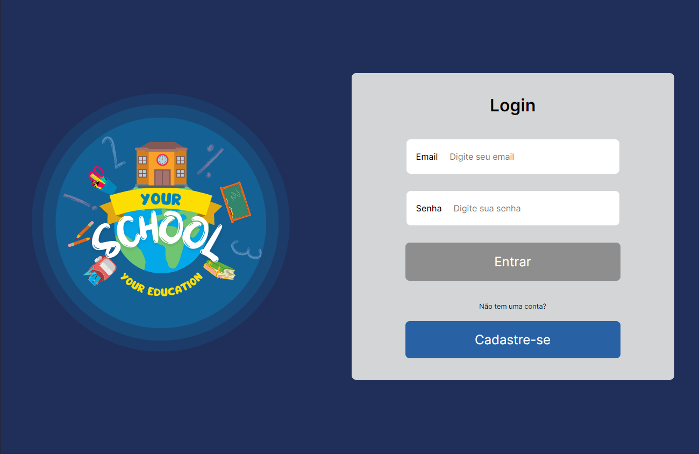
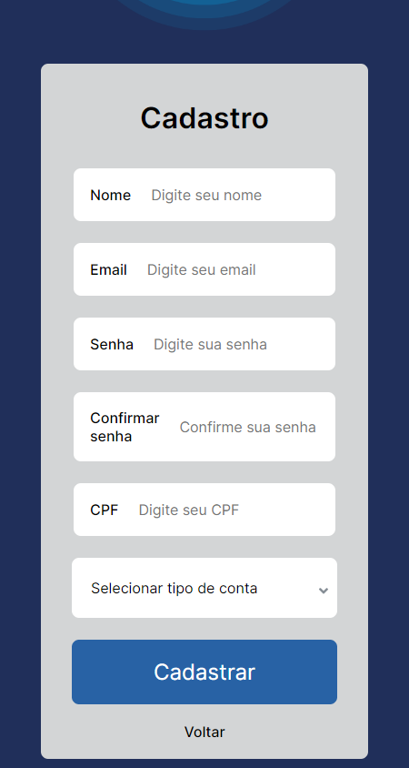
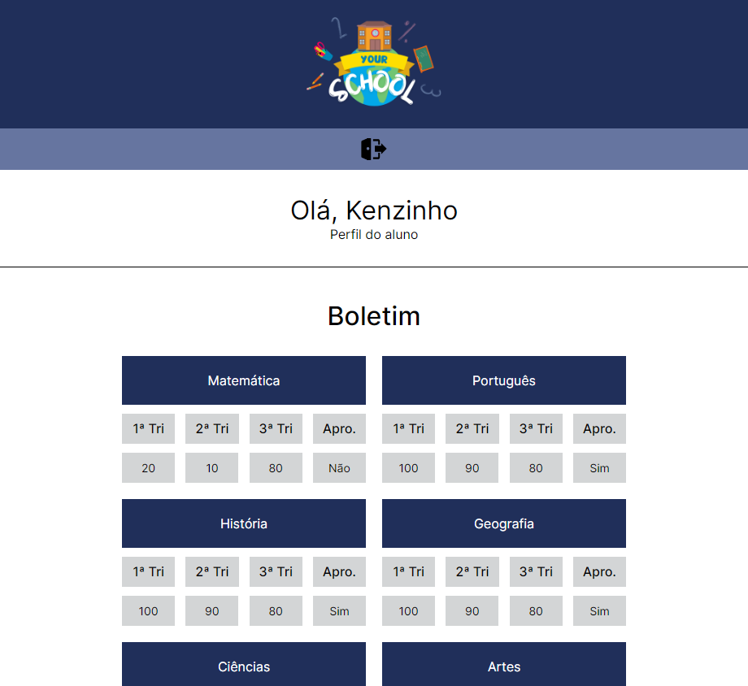
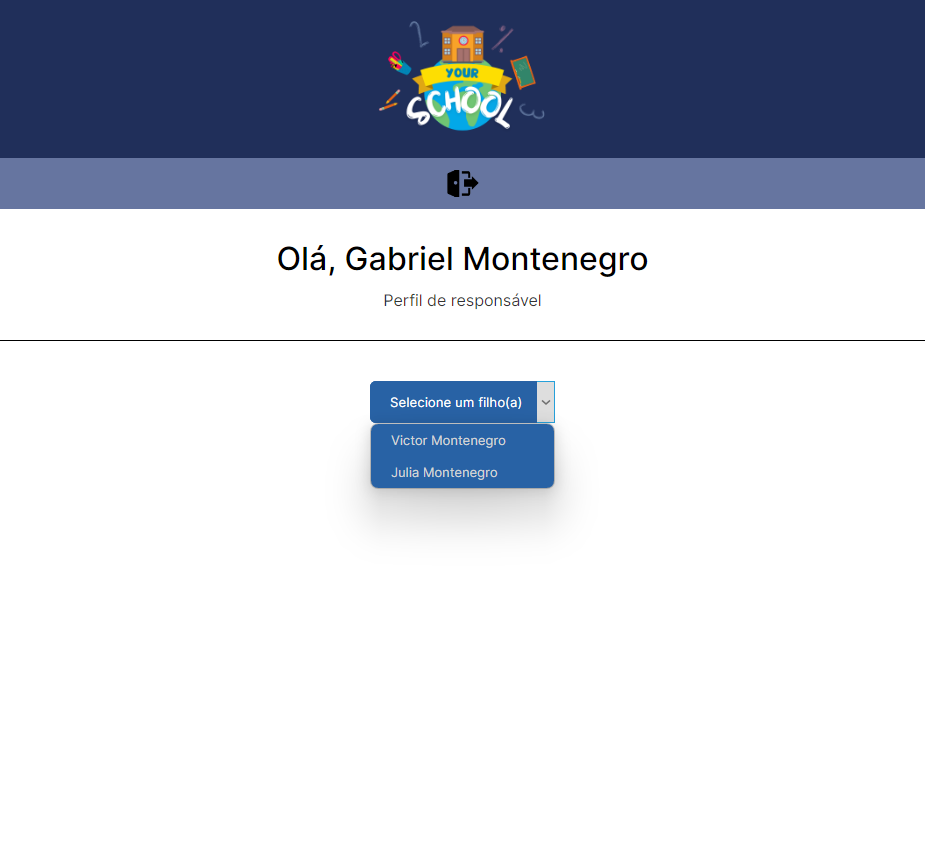
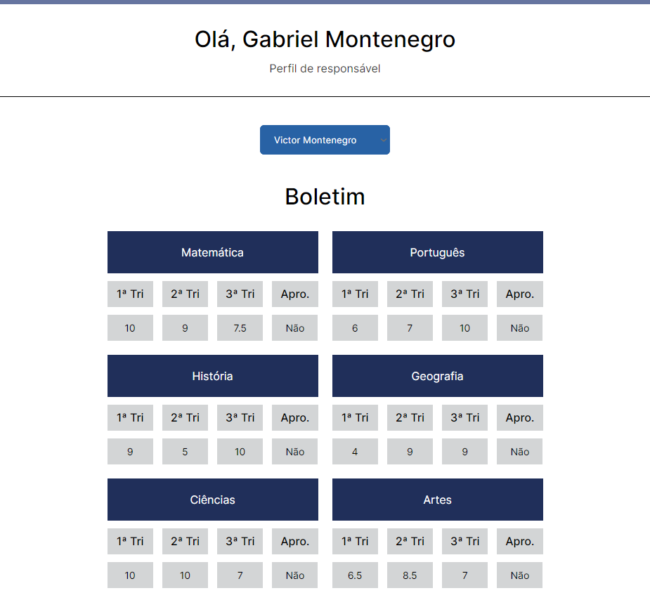
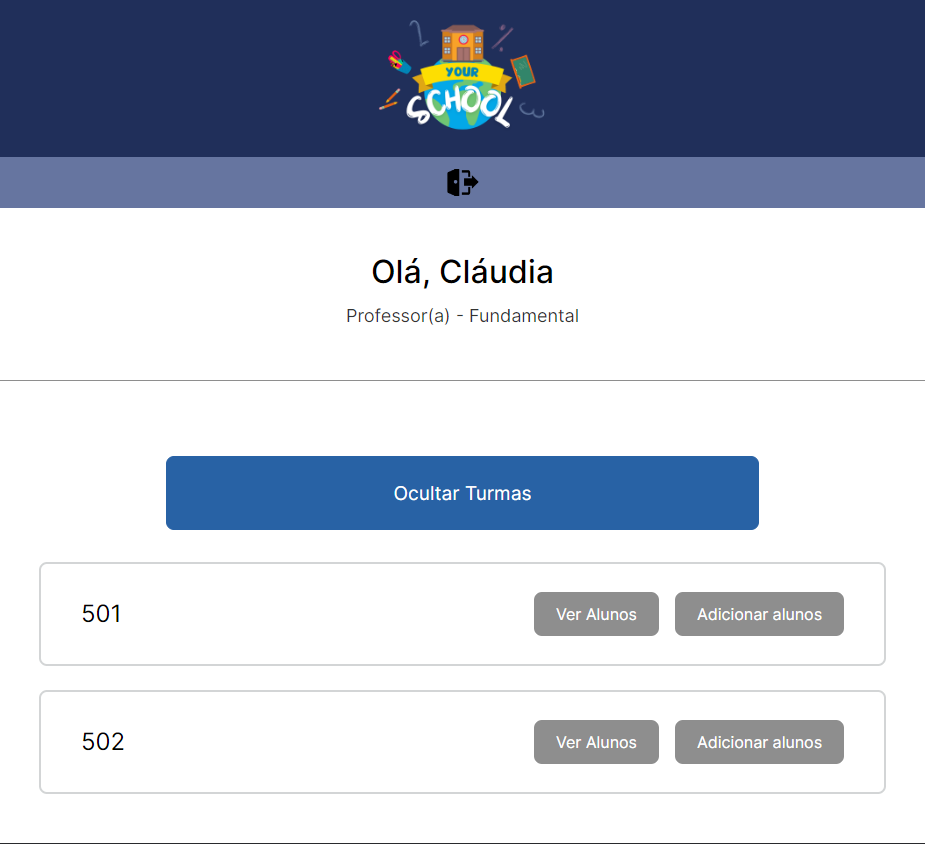
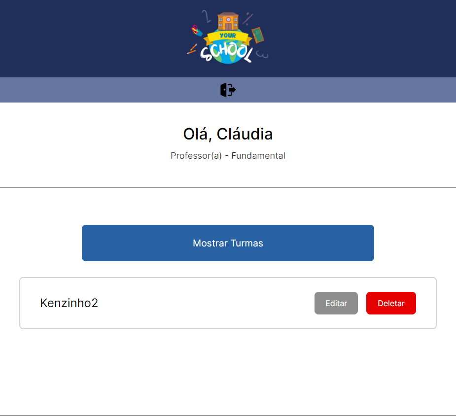
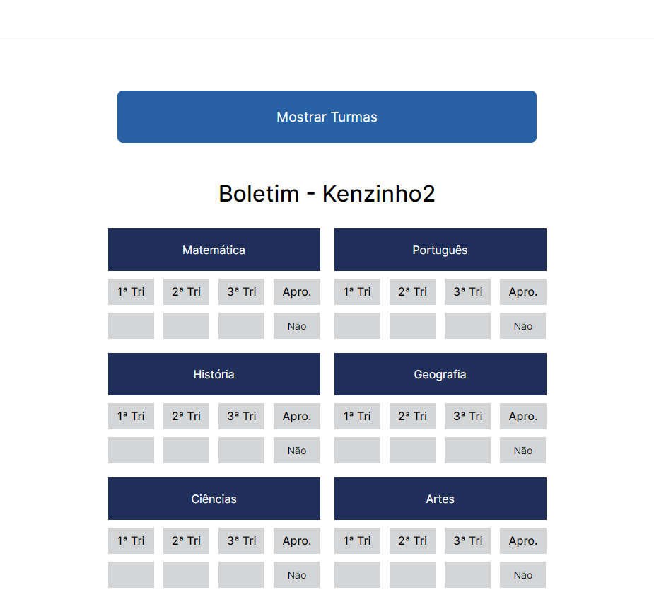
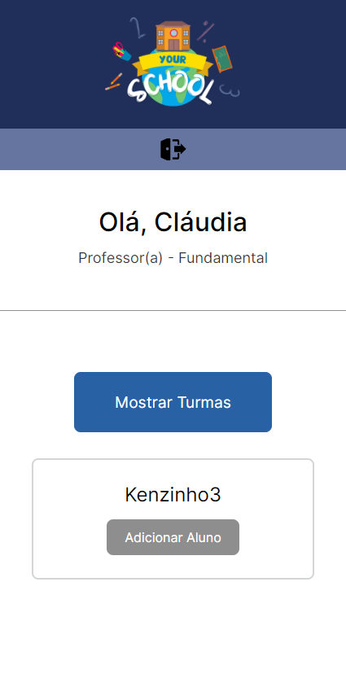
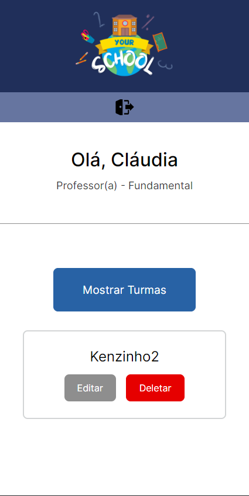

# Resumo do projeto

Your School é um MVP para controle e visualização de notas escolares.
Este projeto foi desenvolvido no final do terceiro módulo da Kenzie Academy (6 meses) e foi feito em equipe. Todo o projeto é responsivo para todos os tamanhos de tela e foi desenvolvido em Mobile First.

# 🔨 Funcionalidades do projeto

-   `Cadastro/Login/Autologin`: é possível criar conta e fazer login, o token fica salvo no localStorage fazendo o autologin e conta com 3 tipos de usuários
-   `Professores`: conseguem adicionar e remover alunos das turmas, conseguem acessar todos os alunos da turma para visualizar, adicionar, editar ou remover notas em várias matérias dos 3 trimestres. Conseguem ver se o aluno está ou não aprovado em cada matéria.
-   `Responsáveis`: conseguem visualizar a nota de todos os alunos pelos quais é responsável
-   `Alunos`: consegue visualizar somente sua própria nota

## ✔️ Técnicas e tecnologias utilizadas

-   `React-TS`
-   `ContextAPI`
-   `CRUD usando Json-Server e Json-Server-Auth como API fake`
-   `react-router-dom`
-   `react-hook-form yup e yupResolver`
-   `axios try catch`
-   `styled-components`
-   `toastify`
-   `Vite`
-   `Yarn`
-   `Vercel - hospedagem do front`
-   `Render: hospedagem da API fake`
-   `Padrão de código (ESLint)`
-   `Trello`
-   `Figma`

# 🛠️ Abrir e rodar o projeto

Basta acessar a página no vercel. Pedimos que tenha um pouco de paciência, pois a hospedagem gratuita da fake API demora um pouco para responder.

Caso queira acessar a página de professor, esse é o login:

Usuário de professor (admin): login: professor@mail.com

Senha: 123456 

Deploy: https://your-school.vercel.app/

Fake API: https://github.com/Kenzie-Schools-grupo05/json-server

Repositório original: https://github.com/Kenzie-Schools-grupo05/Your-School

# 🛠️ Como funciona o projeto

## 1 - Ao acessar a página, você verá a página de login

 

## 2 - É possível fazer cadastro, caso seja um aluno/responsável novato

 

## 3 - Ao fazer login sendo aluno, você terá acesso a sua Dashboard com as notas

 

## 4 - Caso seja responsável e faça login, terá acesso a Dashboard em que é possível escolher o boletim de qual filho deseja visualizar

 

## 5 - Ao selecionar um filho, seu boletim será exibido

 

## 6 - No acesso do professor, temos a Dashboard diferente, com diversas funcionalidades extras

 

### 6.1 - Ver os alunos matriculados na turma selecionada

  

### 6.2 - Editar as notas e aprovação do aluno selecionado

  

### 6.3 - Adicionar alunos que ainda não estão matriculados em nenhuma turma

  

### 6.4 - Deletar/Remover aluno da sua turma atual

  

# Autores

<table>
  <tr>
    <td align="center">
      <a href="https://github.com/AlexandreVianaDev">
         
        
          <b>Alexandre Viana</b>
        
      </a>
    </td>
    <td align="center">
      <a href="https://github.com/arthurbda">
         
        
          <b>Arthur Barreto</b>
        
      </a>
    </td>
    <td align="center">
      <a href="http://github.com/isgabriel">
         
        
          <b>Gabriel Montenegro</b>
        
      </a>
    </td>
    <td align="center">
      <a href="https://github.com/GustavoGCM">
         
        
          <b>Gustavo Cruz</b>
        
      </a>
    </td>
    <td align="center">
      <a href="https://github.com/SandraMatos9">
         
        
          <b>Sandra Rodrigues</b>
        
      </a>
    </td>
  </tr>
</table>

Obrigado por acessar o nosso repositório. Se gostou, siga os autores no github :)

